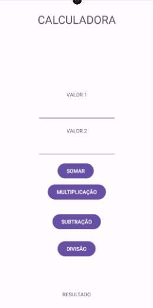

## APP CALCULADORA

### SOBRE O PROJETO
- Esse projeto foi pensando para treinar os comandos de mobile, sendo ultilizado com a turma do técnico do CSL.

### LAYOUT DAS TELAS

### TECNOLOGIAS ULTILIZADAS
- Android Studios

### BACKEND
- Java(mobile)

### FRONTEND
- XML(Activity)

### IDE
- Android Studios

### APK DO PROJETO
https://drive.google.com/file/d/1Ieh1SdeiNmfp1KjbYWNVITk0b_soe1M0/view?usp=share_link LINK PARA DOWNLOAD DA CALCULADORA

### COMO INSTALAR
- 1° Acesse o link
  
- 2° Acesse o arquivo do link

- 3° Clique em instalar
Após isso so testar

### PRÉ REQUISITOS
- Android 8.0

## CRÉDITOS
Feito por Felipe Sampaio  | 
https://github.com/felipeCsampaio LINK DO PROFILE DE FELIPE SAMPAIO
